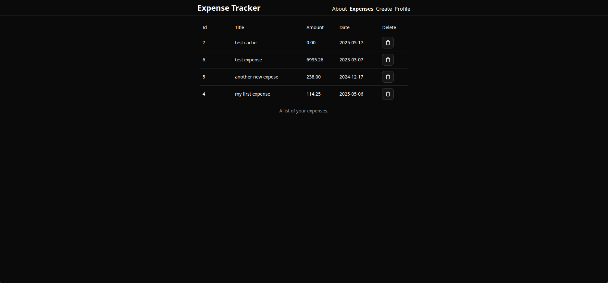
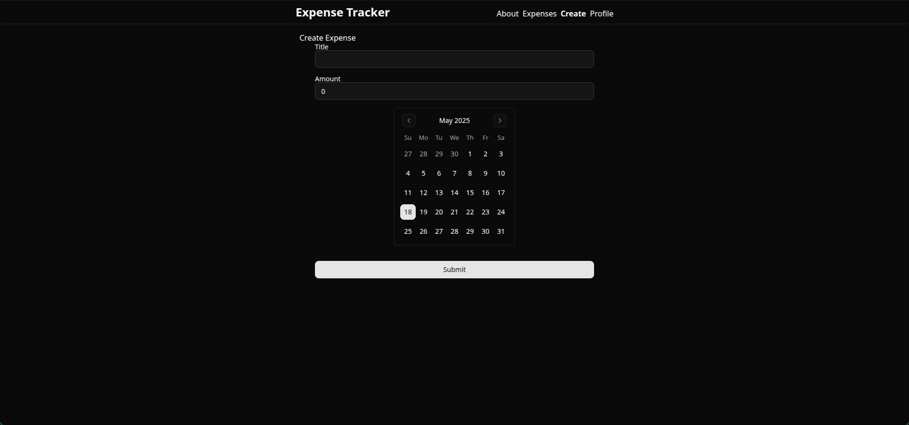

# Expense Tracker

An expense tracker application built with **Bun**, **Hono**, **Neon PostgreSQL**, **TenStack** and **Drizzle** This app allows users to manage their expenses efficiently with a modern frontend and a robust backend.





## Table of Contents

- [Features](#features)
- [Getting Started](#getting-started)
  - [Prerequisites](#prerequisites)
  - [Installation](#installation)
  - [Environment Variables](#environment-variables)
- [Technologies Used](#technologies-used)
- [License](#license)

---

## Features

- **Frontend**: Built with Vite, TenStack and React.
- **Backend**: Powered by Bun Hono and connected to a Neon PostgreSQL database.
- **Database**: Neon PostgreSQL for fast and scalable database management.

---

## Getting Started

### Prerequisites

- [Node.js](https://nodejs.org/) (for Vite and React).
- [Bun](https://bun.sh/) installed on your system.
- [Neon](https://neon.tech) PostgreSQL database set up.

---

### Installation

Clone the repository:

```bash
git clone https://github.com/your-username/expense-tracker.git
cd expense-tracker
```

- **Backend Setup**

```bash
bun install
bun migrate.ts
```

- **Frontend Setup** <br>
  In separate terminal

```bash
cd frontend
bun install
bun run build
```

- **Run the Application** <br>
  In root directory
  add `.env` file with your [environment variables](#environment-variables)

```bash
bun start
```

### Environment Variables

Create a `.env` file in the root directory and add your Neon PostgreSQL connection string, kinde Authentication and other necessary environment variables:

```env
KINDE_ISSUER_URL=<your-kinde-issuer-url>
KINDE_CLIENT_ID=<your-kinde-client-id>
KINDE_CLIENT_SECRET=<your-kinde-client-secret>
KINDE_DOMAIN=<your-kinde-domain>
KINDE_SITE_URL=http://localhost:3000
KINDE_LOGOUT_REDIRECT_URI=http://localhost:3000
KINDE_REDIRECT_URI=http://localhost:3000/api/callback
NODE_ENV=production
CALLBACK_URL=http://localhost:3000/


DATABASE_URL=<your-neon-postgresql-connection-string>

VITE_API_URL=/
```

## Technologies Used

- **Frontend**: Vite, React, TenStack
- **Backend**: Bun, Hono
- **Database**: Neon PostgreSQL
- **ORM**: Drizzle
- **Authentication**: Kinde
- **Styling**: Tailwind CSS

## License

This project is licensed under the MIT License. See the [LICENSE](./LICENCE) file for details.
